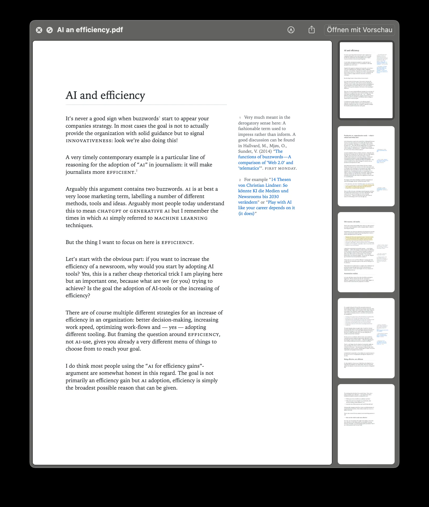

# Sidenotes iA Writer Template

Custom iA Writer template with generated sidenotes for markdown footnotes.

## Package File Structure

```text
.
|-- Sidenotes.iatemplate/
    `-- Contents/
        |-- Info.plist
        `-- Resources/
            |-- document.html
            |-- LICENSE.txt
            |-- sidenotes-markdown-dark.css
            |-- sidenotes-markdown-light.css
            |-- sidenotes.css
            |-- sidenotes.html
            `-- sidenotes.js
```

## Example



## Install / Reload (macOS)

1. Install the `.iatemplate` bundle in iA Writer Preferences.
2. iA Writer copies templates on install, so source edits are not live.
3. After changes, reinstall the template or edit the installed copy.
4. In Preview, use `Shift + Cmd + R` to hard-reload.

## Notes

- Sidenotes are generated from footnote references by `sidenotes.js`.
- Sidenotes use a measured post-layout adjustment pass to avoid overlapping each other and to keep notes away from the bottom edge in wide-screen and print layouts.
- Typography and layout variables are centralized in `sidenotes-variables.css`.
- Print behavior is configured in the `@media print` section.

## Typographic Features

- Regular emphasis (`*italic*`) remains italic.
- Combined emphasis (`***bold italic***` or nested bold+italic tags) is styled as italic small caps.
- Monospaced treatment for code, superscripts, and sidenote markers for visual contrast and stable alignment.
- Blockquote highlight option: bold text inside blockquotes is rendered as a soft marker-style highlight using `--blockquote-highlight-bg`.
- Responsive spacing and rhythm variables (body size, line height, heading spacing, list spacing) are exposed as CSS custom properties.

## Limitations

- Very tall sidenotes can still be constrained by the available page/viewport height, so the layout prioritizes preserving source order and avoiding collisions over perfectly compact packing.
- Print/PDF layout is still constrained by WebKit pagination and can show vertical jumps near page breaks.
- Sidenote generation depends on JavaScript execution in iA Writer preview/export.
- Installed templates are copied by iA Writer, so source edits require reinstalling or editing the installed bundle.
